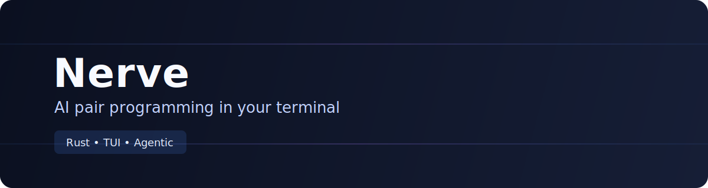

<p align="center">
  
</p>

<h1 align="center">Nerve</h1>
<p align="center"><strong>Open-source AI coding assistant for the terminal.</strong></p>

<p align="center">
  <a href="LICENSE"></a>
  <a href="https://www.rust-lang.org/"></a>
  <a href="https://github.com/Artaeon/nerve/actions/workflows/ci.yml"></a>
  <a href="https://github.com/Artaeon/nerve/releases"></a>
</p>

Nerve is a terminal-native AI assistant and coding agent built in Rust. It combines a fast TUI, multi-provider model support, and practical developer workflows (file context, command execution, prompt templates, and autonomous agent mode).

## Why Nerve

- **Terminal-first workflow**: chat, edit, run, and iterate without leaving your shell.
- **Provider flexibility**: Claude Code, OpenAI, OpenRouter, Ollama, Copilot, and custom OpenAI-compatible endpoints.
- **Agent mode**: let the assistant read files, edit code, and execute commands in controlled loops.
- **Session continuity**: conversation history, branching, exports, and resume support.
- **Extensible by design**: plugins, custom prompts, automations, and scaffold helpers.

## Quick Start

### Build from source

```bash
git clone https://github.com/Artaeon/nerve.git
cd nerve
cargo build --release
cp target/release/nerve ~/.local/bin/
```

### Run

```bash
nerve
```

Examples:

```bash
nerve -n "Review this error and suggest a fix"
nerve --continue
cat src/main.rs | nerve --stdin -n "Summarize what this module does"
```

## Core Features

### 1) AI chat + coding workflows

- Rich terminal UI with keyboard-first navigation.
- Inline project context via file and command tools.
- Prompt picker with categorized built-in prompts.

### 2) Agent mode

Enable autonomous task execution directly from chat:

```text
/agent on
/file src/main.rs
"Find the bug and add a regression test"
```

### 3) Multi-provider support

Switch providers/models quickly from within the app:

- Claude Code
- OpenAI
- OpenRouter
- Ollama
- GitHub Copilot
- Custom provider

## Common Commands

```text
/help                 Show command help
/provider <name>      Switch AI provider
/model <name>         Switch model
/agent on|off         Toggle autonomous coding agent
/file <path>          Add file context
/run <cmd>            Execute shell command
/test                 Run project tests
/build                Build current project
/export               Export chat to markdown
```

## Installation Requirements

- Rust toolchain (edition 2024 compatible)
- One configured AI provider (or local Ollama)

Optional but useful:

- `gh` CLI (for Copilot integration)
- Project toolchains for languages you work with (Node, Python, Go, etc.)

## Development

```bash
cargo fmt --all -- --check
cargo clippy --all-targets -- -D warnings -A dead_code -A unused_imports
cargo test --all-targets
cargo build --release
```

## Releases

Tagged versions trigger automated builds and publish release artifacts through GitHub Actions.

- CI: `.github/workflows/ci.yml`
- Release: `.github/workflows/release.yml`

## Documentation

- User guide: `docs/GUIDE.md`
- Example prompts: `prompts/example.toml`

## Contributing

Contributions are welcome. Please open an issue or submit a pull request with a clear description, reproduction details (for bugs), and test coverage where applicable.

## License

MIT — see [LICENSE](LICENSE).
